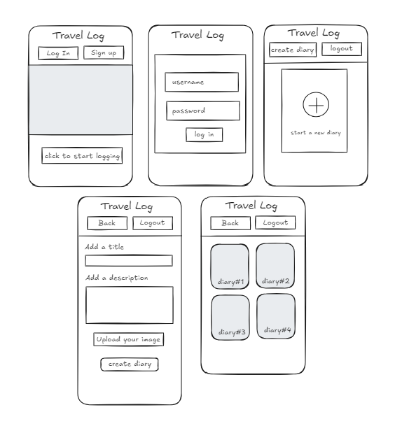

# Travel Log

## Overview

The goal of the Travel Log application is to create a responsive and visually appealing web application where users can document their travel experiences. Users will be able to create entries for different trips, add photos,and write about their adventures. 

### Problem Space

A travel log is needed to help travelers organize and preserve their experiences, going beyond fragmented memories stored on different platforms. It addresses pain points like disorganized photos and notes, lack of depth in social media posts, and difficulty recalling practical travel details. A log offers a personalized space to document stories, photos, and tips, providing a creative outlet while promoting memory preservation and future trip planning.

### User Profile

Frequent travelers, travel enthusiasts, and families will use this app to document, organize, and reflect on their travel experiences, including photos, stories, and trips. 

### Features
- User Authentication
- Create Travel Entries
- View Travel Entries
- Edit Travel Entries
- Delete Travel Entries

## Implementation

### Tech Stack

Front-end: React
Back-end: Express.js
Database: MySQL
ORM: Knex.js
Environment Variables: dotenv
HTTP Client: Axios

### APIs

NA

### Sitemap

List the pages of your app with brief descriptions. You can show this visually, or write it out.

#### A Home Page with a hero image and a button to login/sign up.
#### A Login Page with a form for username, and password.
#### A Create Diary Page to create a new diary entry.
#### A New Entry Form to add trips with destination, date, story, and photos.
#### A Gallery Page to look at the existing diaries.
#### Details Page to look at the particular diary entry.

### Mockups


### Data

The app will primarily consist of Travel Entries, each containing attributes such as ID, Title, Location, Date, Description, and an array of Photos. Each Entry can be linked to multiple Tags (e.g., location, themes).

### Endpoints

Create a New Travel Entry
- Endpoint: POST /api/entries
- Parameters:
    - Body: { "title": "Trip to Paris", "location": "Paris, France", "date": "2024-05-01", "description": "Had an amazing time!", "photos": ["url1", "url2"] }

Retrieve All Travel Entries
- Endpoint: GET /api/entries
- Parameters: None

Retrieve a Specific Travel Entry
- Endpoint: GET /api/entries/:id
- Parameters:
    - URL: :id (e.g., 1)

Update a Travel Entry
- Endpoint: PUT /api/entries/:id
- Parameters:
    - URL: :id (e.g., 1)
    - Body: { "title": "Updated Trip to Paris", "description": "Updated description." }

Delete a Travel Entry
- Endpoint: DELETE /api/entries/:id
- Parameters:
    - URL: :id (e.g., 1)

## Roadmap

Scope your project as a sprint. Break down the tasks that will need to be completed and map out timeframes for implementation working back from the capstone due date. 

Sprint 1 (Week 1): Setup and Basic Structure
Goal: Establish the foundation of the app, including project setup and the layout for core components.

Set up the React project with necessary libraries (React Router, SCSS framework).
Create the Home Page layout with a list view for travel entries.
Develop the New Entry Form with input fields for trip details and a file upload option. Add functionality for edit and delete entries.
Begin styling the app with SCSS for responsiveness and basic aesthetics.

Sprint 2 (Week 2): Functionality and Final Touches
Goal: Implement core functionalities and finalize design elements for a polished user experience.

Implement search and filter functionalities to organize travel entries by location or tags.
Conduct user testing for feedback on usability and make necessary adjustments.
Finalize styling, ensure mobile responsiveness.
Integrate with the backend.
Test for user data storage.


---

## Future Implementations
- Search and Filter features to find trips by location, date, or tags.


# Travel Log

Travel Log is a web application that allows users to create and manage travel journals. Users can document their travels by creating diaries and adding places with descriptions and images.

## Table of Contents

- [Features](#features)
- [Technologies Used](#technologies-used)
- [Getting Started](#getting-started)
  - [Prerequisites](#prerequisites)
  - [Installation](#installation)
  - [Running the Application](#running-the-application)
- [Project Structure](#project-structure)
- [Usage](#usage)
- [Contributing](#contributing)
- [License](#license)

## Features

- Create and manage travel diaries
- Add places to diaries with descriptions and images
- Responsive design for mobile and desktop
- User authentication (using localStorage)

## Technologies Used

- React
- React Router
- SCSS for styling
- Axios for API requests
- Node.js and Express for backend (if applicable)
- MySQL for the database (if applicable)

## Getting Started

To set up the Travel Log project on your local machine, follow these steps:

### Prerequisites

Make sure you have the following installed:

- [Node.js](https://nodejs.org/) (v14 or higher)
- [npm](https://www.npmjs.com/) (Node package manager, comes with Node.js)

### Installation

1. **Clone the repository**:

   ```bash
   git clone https://github.com/yourusername/travel_log.git
   cd travel_log
   ```

   In another terminal,

   ```bash
   git clone https://github.com/varshini-sundaribabu/travel_log_backend.git
   cd travel_log_backend
   ```

2. **Install dependencies**:

   Run the following command in the project directory:

   ```bash
   npm install
   ```

### Running the Application

1. **Start the development server**:

   In the project directory, run:

   ```bash
   npm start
   ```

2. **Open your browser**:

   Navigate to `http://localhost:5173` to see the frontend application in action.
   Navigate to `http://localhost:3000` to run the express application in action.

### Project Structure

```
travel_log/
├── public/                  # Public assets
├── src/                     # Source code
│   ├── components/          # Reusable components
│   ├── pages/               # Page components
│   ├── services/            # API calls
│   ├── styles/              # Global styles
│   ├── App.js               # Main application component
│   ├── index.js             # Entry point
├── .gitignore               # Git ignore file
├── package.json             # Project metadata and dependencies
└── README.md                # Project documentation
```

```
travel_log_backend/
│
├── src/                     # Source files
│   ├── controllers/         # Controllers for handling requests
│   ├── middleware/          # Middleware for processing requests
│   ├── models/              # Database models
│   ├── routes/              # Route definitions
│   ├── services/            # Business logic and services
│   ├── utils/               # Utility functions
│   ├── config/              # Configuration files (e.g., database, environment variables)
│   └── app.js               # Main application file
├── .env                     # Environment variables
├── .gitignore               # Files and folders to ignore by Git
├── package.json             # Project metadata and dependencies
├── package-lock.json        # Lock file for dependencies
└── README.md                # Project documentation
```


### Usage

- **Creating a new diary**: Navigate to the diary creation page and fill out the form to create a new diary.
- **Adding places**: Click on a diary to add places, where you can include descriptions and upload images.
- **Viewing diaries**: The homepage lists all your diaries for easy access.
